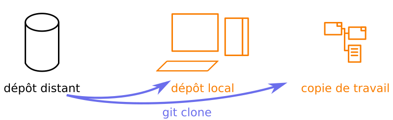
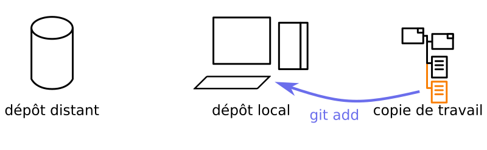
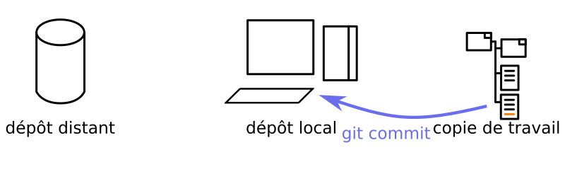
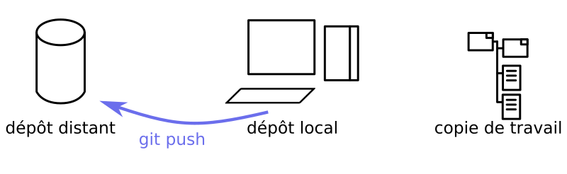
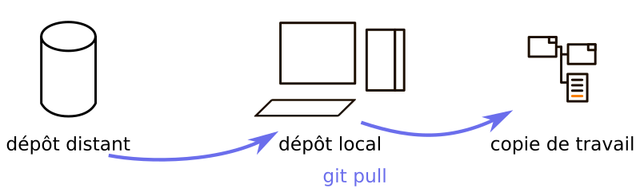

# TP 2: manipuler des branches

Dans ce TP comme dans le précédent, les étudiant·e·s sont invité·e·s à utiliser la documentation pour découvrir les commandes à utiliser, afin d'être autonomes.

## Rappel du TP précédent

À l'occasion du TP 1, vous avez pu utiliser les commandes suivantes:

* `git clone [adresse github]`

* `git add [fichier.md]`

* `git commit [fichier.md]` ou `git commit -a`

* `git push`

* `git pull`

